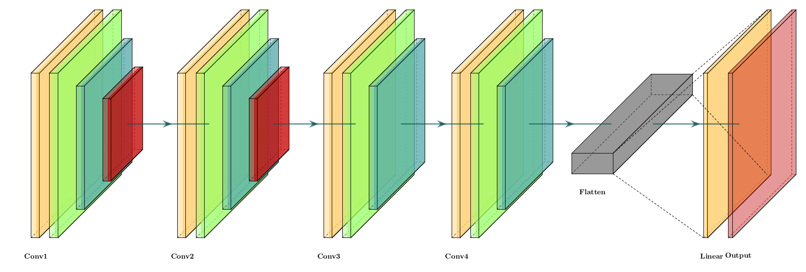
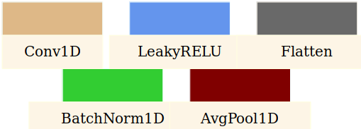

## Log1DNet: A Deep Learning Architecture for Sonic Log Prediction for Seal Rock Identification in Carbon Capture and Storage Projects

## Architecture

<div style="text-align: center;">
    
</div>

## Dataset
- All data used for training and testing the model can be downloaded [here](https://drive.google.com/drive/folders/1xK_xrf7EqFlsz_4YhG1tcyKB7ceUKV-l?usp=sharing) 
- Create a folder named `data` in the current directory. Move the downloaded well files here.
## Install requirements

```shell 
pip install -r requirements.txt
```

## Run notebook

Open and run all cells in the [Log1DNet](https://github.com/joshua-atolagbe/Log1DNet/blob/master/Log1DNet.ipynb) notebook to get the same results reported in the paper 
